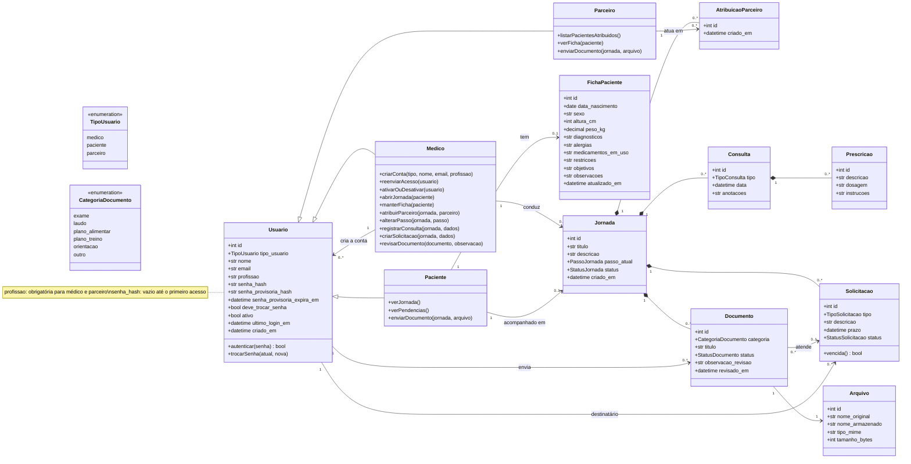
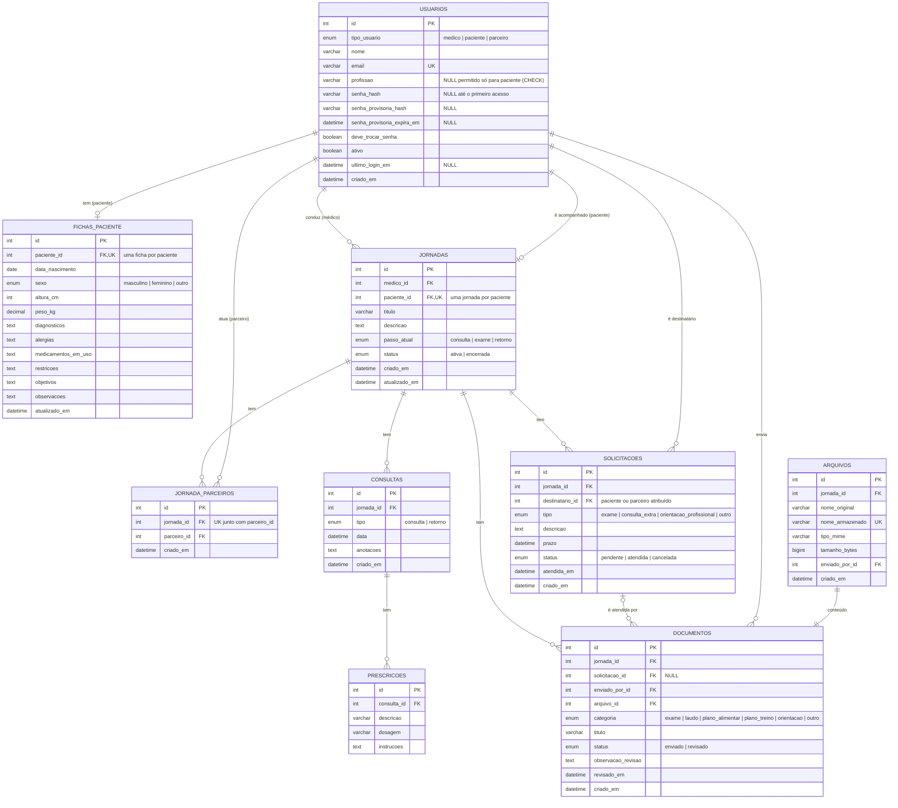
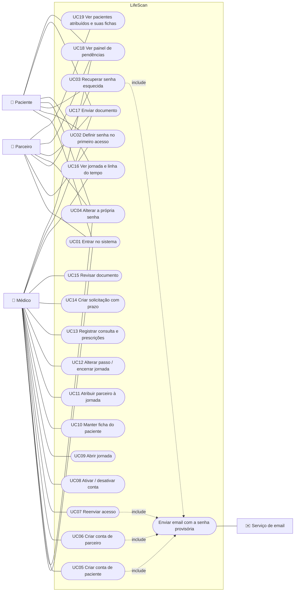

# LifeScan: diagramas

Diagramas em [Mermaid](https://mermaid.js.org). O GitHub mostra os diagramas desenhados; também
dá para colar o código em <https://mermaid.live>.

Os diagramas refletem o modelo implementado.

## Diagrama de classes

No modelo conceitual, Médico, Paciente e Parceiro são especializações de Usuário. No banco,
as três ficam em uma única tabela (`usuarios`), diferenciadas por `tipo_usuario`.

## Diagrama ER

## Diagrama de casos de uso

O Mermaid não tem um tipo próprio para casos de uso; o fluxograma abaixo segue o mesmo formato.

