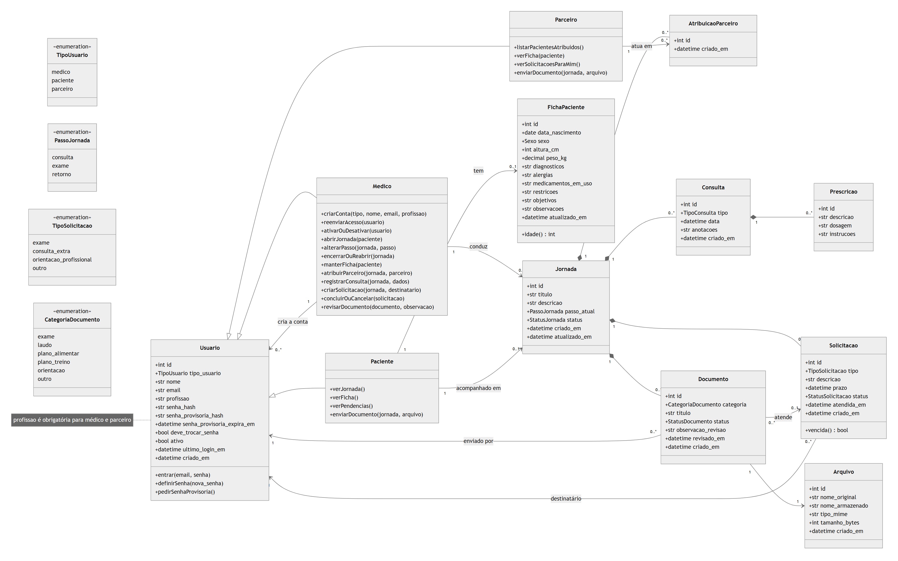
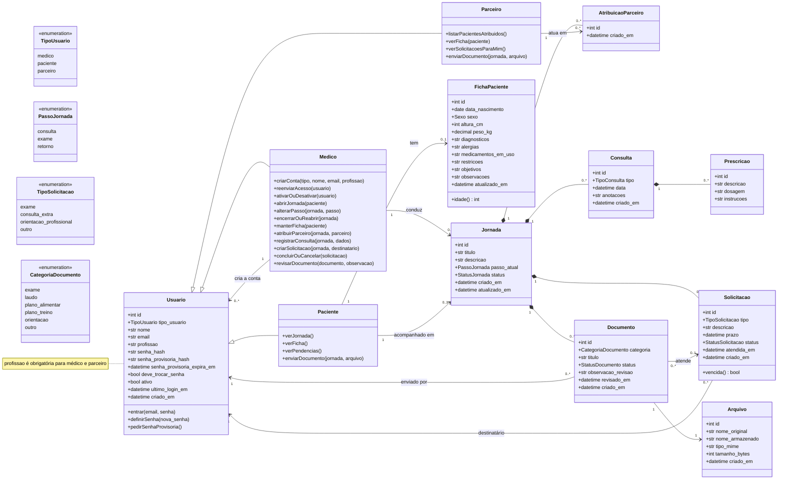
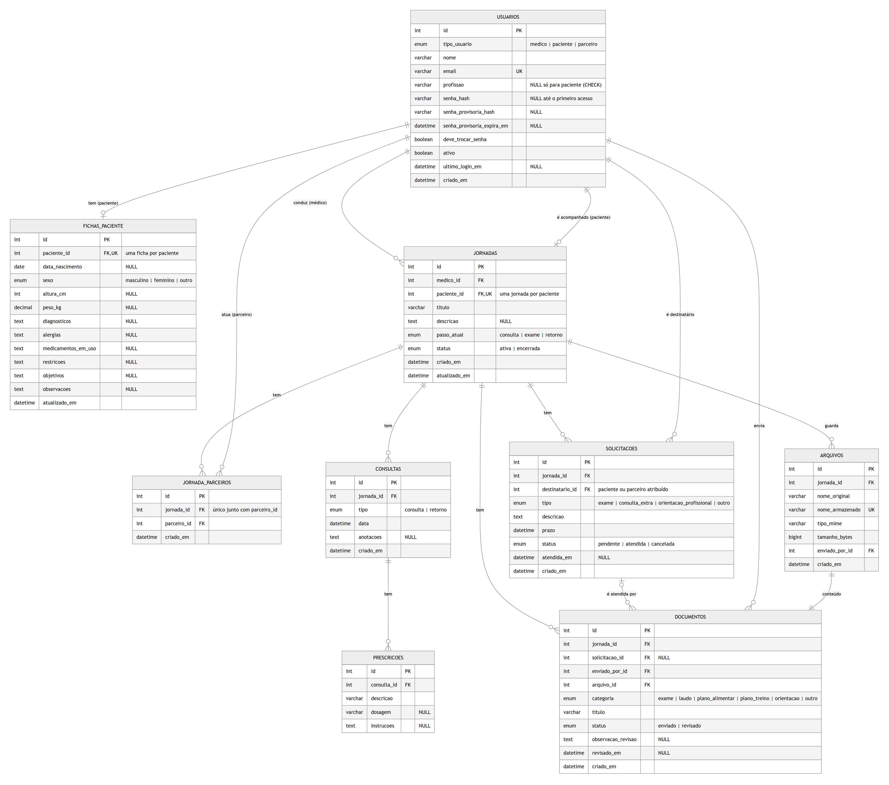
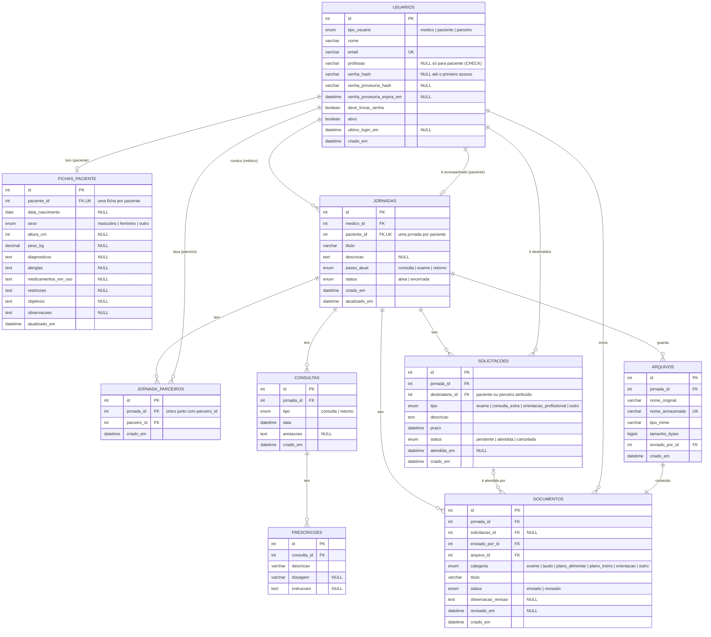
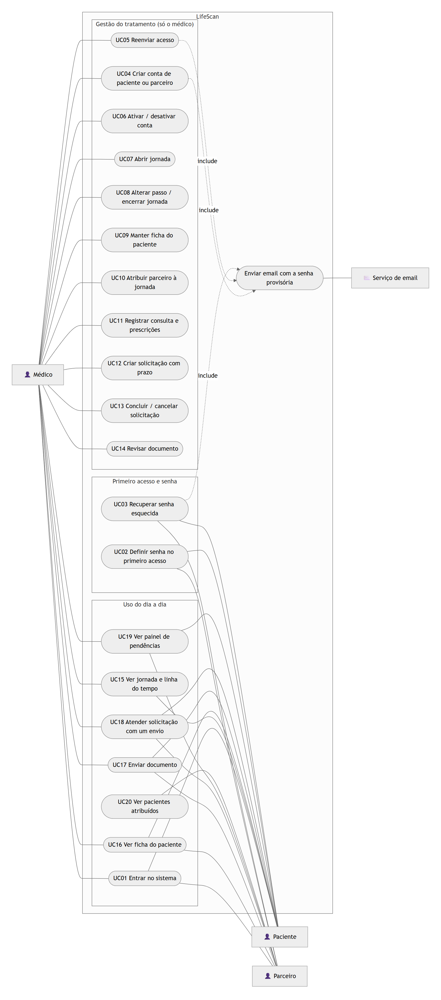
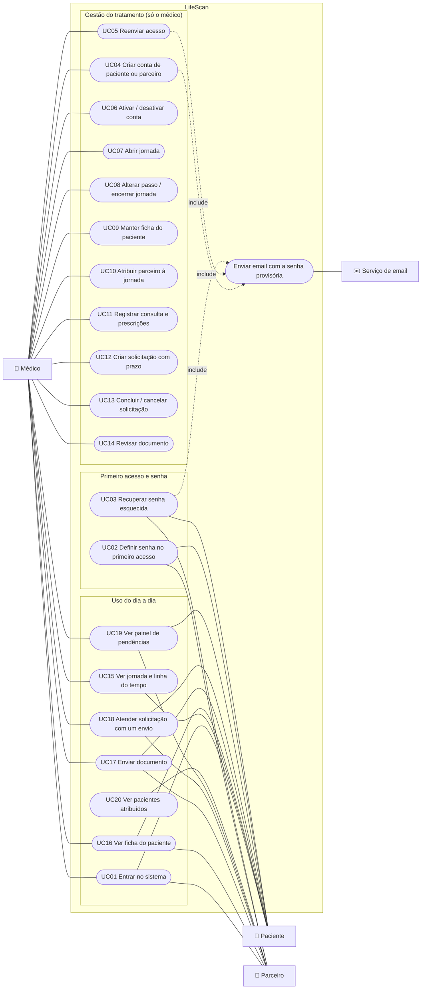

# LifeScan: diagramas

Diagramas em [Mermaid](https://mermaid.js.org), refletindo o sistema como está implementado.
O GitHub mostra os diagramas desenhados; as mesmas figuras estão em imagem na pasta
[`diagramas/`](diagramas/).

## Diagrama de classes

No modelo conceitual, Médico, Paciente e Parceiro são especializações de Usuário. No banco,
as três ficam em uma única tabela (`usuarios`), diferenciadas por `tipo_usuario`.

- `senha_hash` fica vazio até o primeiro acesso; até lá vale a senha provisória enviada por email.
- `definirSenha` só existe logo depois de entrar com a senha provisória.

## Diagrama ER

Corresponde às tabelas criadas pelas migrações do Alembic.

## Diagrama de casos de uso

O Mermaid não tem um tipo próprio para casos de uso; o fluxograma abaixo segue o mesmo formato.
O médico fica à esquerda; paciente e parceiro, à direita. O paciente não tem o UC20, e o parceiro
não tem o UC15 (ele não vê a linha do tempo, as consultas nem os documentos de outras pessoas).

